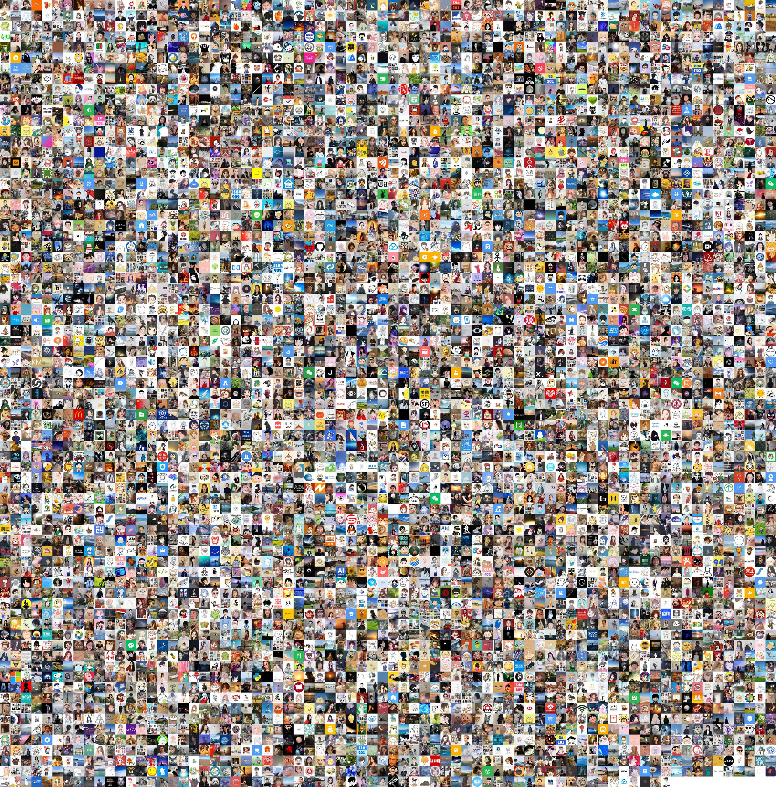
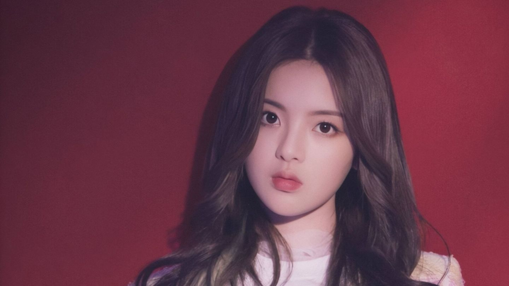
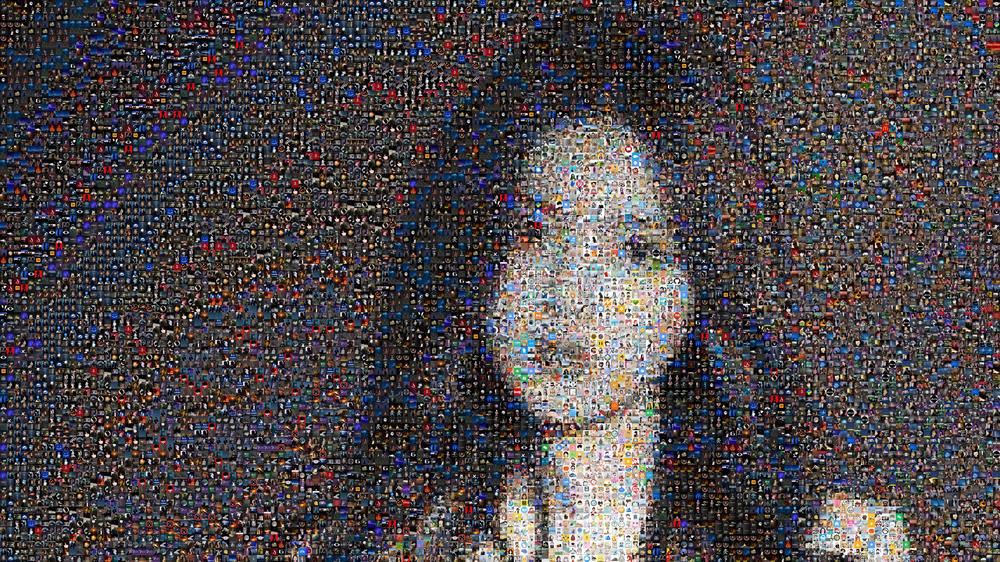

# 有趣的音视频、图像处理脚本合集
这个仓库集合了一些有趣的脚本，例如普通视频转成字符构成的视频、多张图片拼接成一张大的图片等等。

## 图片拼接
### 示例
**微信好友头像合集：**


**杨超越原图：**


**用微信头像拼出来的杨超越：**


### 使用方法
**多张图片拼凑成一张大的矩形图片：**
```shell
python3 image_stitch.py -d [图像合集目录] -s [小图最终的边长] -r
```

**多张图片拼凑出另一张图片：**
```shell
python3 image_stitch.py -d [图像合集目录] -i [待拼凑的图片] -s [小图最终的边长] -r
```

> 实测`-s`设置为30效果最佳，图片大小和质量都比较好。`-r`是随机排列图片。

**生成字符视频：**
```shell
python3 video2char.py
```
